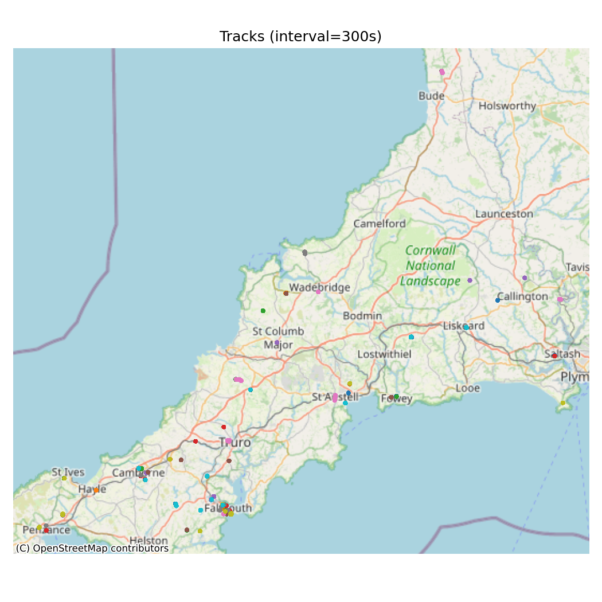

# Pet Cats Movement Analytics Prototype

This project is a prototype of **animal movement ecology pipeline** developed to support research assistant work on GPS-collared livestock (e.g. sheep) in upland grazing systems.  
It is demonstrated here with an open dataset of **pet cats in the UK**, from used as a stand-in for real livestock GPS data.

## Objectives

- Clean and resample raw GPS tracks (e.g. 60s, 300s, 600s intervals).
- Filter unrealistic points based on maximum speed thresholds.
- Compute basic movement metrics:
  - step length
  - speed
  - turning angle
- Detect **dwell behaviour** (stationary periods).
- Enrich locations with **topography** (elevation, slope from DEM).
- Enrich locations with **habitat/land cover** (from ESA WorldCover).
- Summarise and visualise:
  - histograms of movement metrics
  - elevation distributions
  - land cover use bar charts
  - per-individual scatterplots with basemap
- Estimate **home ranges**:
  - Minimum Convex Polygon (MCP)
  - Kernel Density Estimate (KDE proxy)
- Generate a lightweight **report (Markdown + CSV tables)** for easy sharing.

## File Structure

Pet_Cats_Movement_Analytics/

│── prototype.py # Main analysis script

│── requirements.txt # Python dependencies

│── data/ # Input data (.csv, .tif)

│── outputs/ # Results: .csv, .png, .md

## Arguments:

--input : raw tracking CSV (e.g. cats dataset, sheep collars)

--dem : Digital Elevation Model GeoTIFF

--landcover : ESA WorldCover raster

--outdir : directory for outputs

--max-speed-mps : max plausible speed (e.g. 5 m/s cats, 3 m/s sheep)

--resample : resampling interval (seconds)

## Example Outputs (300 s)

- Report: [`artifacts/report_300s.md`](artifacts/report_300s.md)
- Summary table: [`artifacts/summary_300s.csv`](artifacts/summary_300s.csv)
- Home range (MCP): [`artifacts/home_range_mcp_300s.csv`](artifacts/home_range_mcp_300s.csv)
- Home range (KDE-proxy): [`artifacts/home_range_kde_proxy_300s.csv`](artifacts/home_range_kde_proxy_300s.csv)

### Figures

interactive map (open in browser):  
> [`artifacts/tracks_scatter_300s.html`](artifacts/tracks_scatter_300s.html)

## Dependencies

pandas, numpy, geopandas, shapely

matplotlib, seaborn

rasterio, contextily

tabulate
  
## Data Sources

McDonald JL, Cole H. 2020. Data from: The small home ranges and large local ecological impacts of pet cats [United Kingdom]. 
Movebank Data Repository. https://doi.org/10.5441/001/1.pf315732

https://worldcover2021.esa.int/downloader [N30W060]

"A 30 m global map of elevation with forests and buildings removed" published by IOP in Environmental Research Letters at https://dx.doi.org/10.1088/1748-9326/ac4d4f.
